# Shotgun toolkit engine for Blender

Contact : [Diego Garcia Huerta](https://www.linkedin.com/in/diegogh/)


## Overview

Implementation of a shotgun engine for [**Blender**](https://blender.org). It supports the classic bootstrap startup methodology and integrates with Blender adding a new Shotgun Menu in the main Blender tool-bar.

* [Engine Installation](#engine-installation)
* [Configuring your project for Shotgun Toolkit](#configuring-your-project-for-shotgun-toolkit)
* [Modifying the toolkit configuration files to add this engine and related apps](#modifying-the-toolkit-configuration-files-to-add-this-engine-and-related-apps)
* [Modifying the Templates](#modifying-the-templates)
* [Configuring Blender in the software launcher](#configuring-blender-in-the-software-launcher)
* [Configuring Blender Engine Requirements](#configuring-blender-engine-requirements)
* [Caching and downloading the engine into disk](#caching-and-downloading-the-engine-into-disk)
* [Blender engine should be available in Shotgun Desktop](#blender-engine-should-be-available-in-shotgun-desktop)
* [Toolkit Apps Included](#toolkit-apps-included)

With the engine, hooks for most of the standard tk applications are provided:

* [tk-multi-workfiles2](#tk-multi-workfiles2)
* [tk-multi-snapshot](#tk-multi-snapshot)
* [tk-multi-loader2](#tk-multi-loader2)
* [tk-multi-publish2](#tk-multi-publish2)
* [tk-multi-breakdown](#tk-multi-breakdown)
* [tk-multi-setframerange](#tk-multi-setframerange)

More:
* [Blender engine options](#blender-engine-options)
* [Development notes](#development-notes)
  * [Blender Development notes](#blender-development-notes)
  * [Python3 Shotgun toolkit](#python3-shotgun-toolkit)
  * [PySide2 Shotgun Toolkit support](#pyside2-shotgun-toolkit-support)

**Disclaimer**

**This engine has been developed and tested in Windows 10 using the following Blender versions: 2.82.0, 2.83.0, 2.90.0, 2.92.0 (alpha)**

The engine has not been used in production before so **use it at your own risk**. Also keep in mind that some of the hooks provided might need to be adapted to your work flows and pipelines. If you use it in production, I would love to hear about it, drop me a message in the contact link at the beginning of this documentation.


## Engine Installation

When I started using shotgun toolkit, I found quite challenging figuring out how to install and configure a new tk application or a new engine. Shotgun Software provides extensive documentation on how to do this, but I used to get lost in details, specially with so many configuration files to modify.

If you are familiar with how to setup an engine and apps, you might want to skip the rest of this document, just make sure to check the [templates](config/core/templates.yml) and [additions to the configs](config/env) that might give you a good start.

If you are new to shotgun, I also recommend to read at least the following shotgun articles, so you get familiar with how the configuration files are setup, and the terminology used:

* [App and Engine Configuration Reference](https://support.shotgunsoftware.com/hc/en-us/articles/219039878-App-and-Engine-Configuration-Reference)
* [Overview of Toolkit's New Default Configuration](https://support.shotgunsoftware.com/hc/en-us/articles/115004077494-Overview-of-Toolkit-s-New-Default-Configuration-)

Here are detailed instructions on how to make this engine work assuming you use a standard shotgun toolkit installation and have downloaded shotgun desktop.
[Shotgun Desktop Download Instructions](https://support.shotgunsoftware.com/hc/en-us/articles/115000068574#Getting%20started%20with%20Shotgun%20Desktop)

Also an amazing resource to look for help when configuring your engine, is the [Shotgun Community Forums](https://community.shotgunsoftware.com/), specifically under *Pipeline Integrations* category.

Finally, this link contains the technical reference for Shotgun toolkit and related technologies, a great effort to collate all the tech documentation in a single place:
[Shotgun's Developer Documentation](https://developer.shotgunsoftware.com/)

## Configuring your project for Shotgun Toolkit

If you haven't done it yet, make sure you have gone through the basic steps to configure your project to use shotgun toolkit, this can be done in shotgun desktop app, by:
* enter into the project clicking it's icon

* click on the user icon to show more options (bottom right)

* click on *Advanced project setup*

    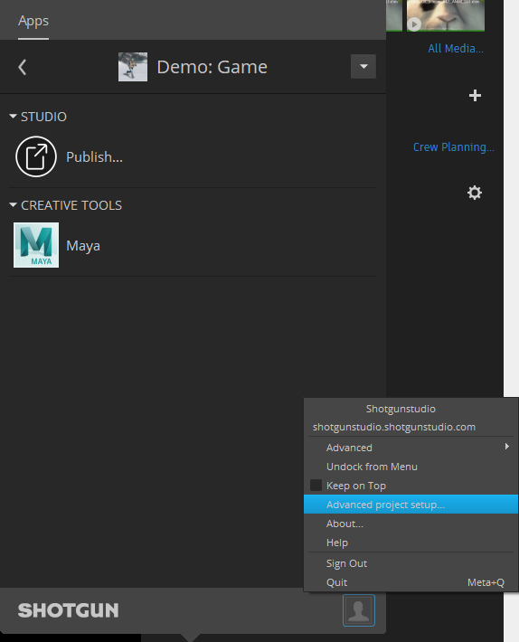

* *Select a configuration*: "Shotgun Default" or pick an existing project that you have already setup pages and filters for.
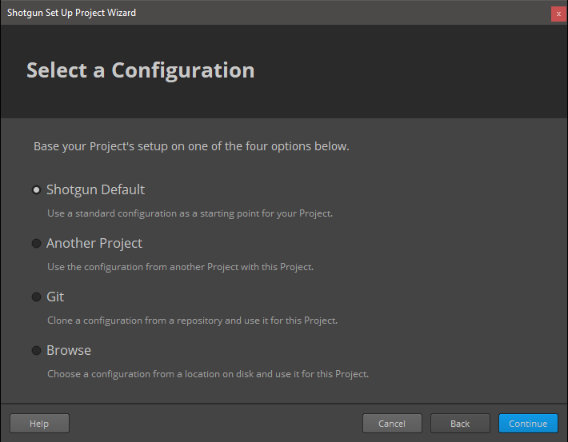

* *Select a Shotgun Configuration*: select "default" which will download the standard templates from shotgun. (this documentation is written assuming you have this configuration)
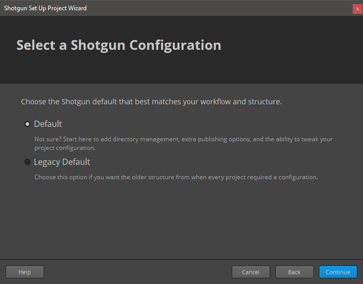

* *Define Storages*: Make sure you name your first storage "primary", and a choose a primary folder where all the 'jobs' publishes will be stored, in this case "D:\demo\jobs" for illustrative purposes.


* *Project Folder Name*: This is the name of the project in disk. You might have some sort of naming convention for project that you might follow, or leave as it is. (My advice is that you do not include spaces in the name)
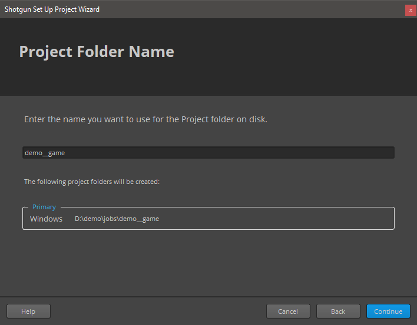

* *Select Deployment*: Choose "Centralized Setup". This will be the location of the configuration files (that we will be modifying later). For example, you could place the specific configuration for a project (in this example called game_config) within a folder called "configs" at the same level then the jobs folder, something like:
```shell
├───jobs
└───configs
    └───game_config
        ├───cache
        ├───config
        │   ├───core
        │   │   ├───hooks
        │   │   └───schema
        │   ├───env
        │   │   └───includes
        │   │       └───settings
        │   ├───hooks
        │   │   └───tk-multi-launchapp
        │   ├───icons
        │   └───tk-metadata
        └───install
            ├───apps
            ├───core
            ├───engines
            └───frameworks
```
(Note that this might not be suitable for more complex setups, like distributed configurations)
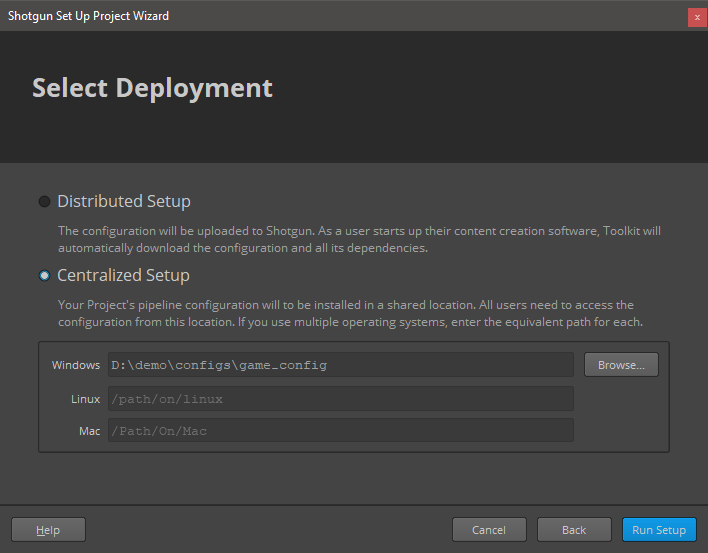


## Modifying the toolkit configuration files to add this engine and related apps

Every pipeline configuration has got different environments where you can configure apps accordingly. (for example you might want different apps depending if you are at an asset context or a shot context. The configured environments really depend on your projects requirements. While project, asset, asset_step, sequence, shot, shot_step, site are the standard ones, it is not uncommon to have a sequence_step environment or use a episode based environment either.

I've included a folder called 'config' in this repository where you can find the additions to each of the environments and configuration YAML files that come with the [default shotgun toolkit configuration repository](https://github.com/shotgunsoftware/tk-config-default2) (as of writing)

[configuration additions](config)

These YAML files provided **should be merged with the original ones as they won't work on their own.**

As an example, for the location of the engine, we use a git descriptor that allows up to track the code from a git repository. This allows easy updates, whenever a new version is released. So in the example above, you should modify the file:

``.../game_config/config/env/includes/engine_locations.yml``

and add the following changes from this file:
[engine_locations.yml](config/env/includes/engine_locations.yml)

```yaml
# Blender
engines.tk-blender.location:
  type: git
  branch: master
  path: https://github.com/diegogarciahuerta/tk-blender.git
  version: v1.0.0
```

**Do not forget to update the version of the engine to the latest one. You can check here which one is the [latest version](https://github.com/diegogarciahuerta/tk-blender/releases)**

In your environments you should add tk-blender yml file, for example in the asset_step yml file:

``/configs/game_config/config/env/asset_step.yml``

Let's add the include at the beginning of the file, in the 'includes' section:

```yaml
- ./includes/settings/tk-blender.yml
```

Now we add a new entry under the engines section, that will include all the information for our Blender application:

```yaml
  tk-blender: "@settings.tk-blender.asset_step"
```

And so on.

Finally, do not forget to copy the additional `tk-blender.yml` into your settings folder.

``/configs/game_config/config/env/includes/settings``


## Modifying the Templates

The additions to `config/core/templates.yml` are provided also under the config directory of this repository, specifically:

[templates.yml](config/core/templates.yml)


## Configuring Blender in the software launcher

In order for our application to show up in the shotgun launcher, we need to add it to our list of software that is valid for this project.

* Navigate to your shotgun URL, ie. `example.shotgunstudio.com`, and once logged in, clink in the Shotgun Settings menu, the arrow at the top right of the web page, close to your user picture.
* Click in the Software menu


* We will create a new entry for Blender, called "Blender" and whose description can be conveniently copy and pasted from [Blender entry in Wikipedia](https://en.wikipedia.org/wiki/Blender)
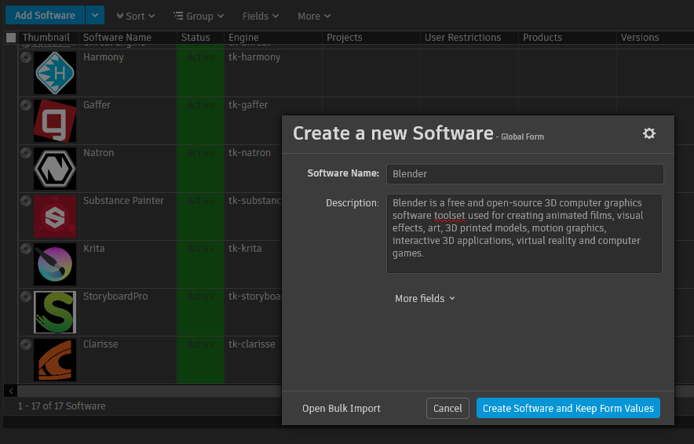

* We now should specify the engine this software will use. "tk-blender"

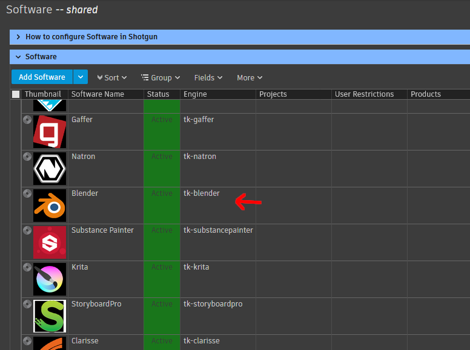

* Note that you can restrict this application to certain projects by specifying the project under the projects column. If no projects are specified this application will show up for all the projects that have this engine in their configuration files.

If you want more information on how to configure software launches, here is the detailed documentation from shotgun.
[Configuring software launches](https://support.shotgunsoftware.com/hc/en-us/articles/115000067493#Configuring%20the%20software%20in%20Shotgun%20Desktop)

## Configuring Blender Engine Requirements

# PySide2 Installation

PySide2 is required to run toolkit applications. It must be installed in a place where python within Blender can find it as a module.

One option is to install this library within the bundled python version that comes with Blender: (windows example)

`C:\Program Files\Blender Foundation\Blender 2.82\2.82\python\bin\python.exe -m pip install PySide2`

If you are using Windows, make sure you run and Administrator console, as the vanilla installation of Blender might be in `Program Files` folder, which only administrators have write access to.

Alternatively for more modular pipelines, where the location of Pyside2 is more bespoke:

`PYSIDE2_PYTHONPATH` Environment variable can be used to configure this location if you decide not to install it within Blender python site-packages.

If the shotgun menu does not show up after you launch Blender from Shotgun Desktop, please check the console for any possible errors:

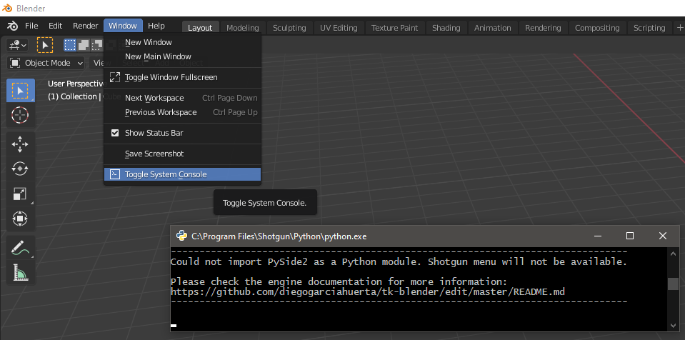

# tk-framework-shotgunutils v5.7.7+

Please make sure you use this version (or above) of tk-framework-shotgunutils. In some cases, I've found that Blender would freeze when closing toolkit applications while these application were doing some operations (ie. searching for workfiles in tk-multi-workfiles2, or even in tk-multi-about displaying the current environment).
The good news is that I was not able to reproduce the problem if I updated to the a recent version of tk-framework-shotgunutils (version v5.7.7 or above), which fixes some issues with threading that were causing Blender to freeze.

You can modify the version for this framework here:
``/configs/game_config/config/env/includes/frameworks.yml``

It should look something like:

```yaml
  # shotgunutils v5 - Shotgun Related Utilities
  tk-framework-shotgunutils_v5.x.x:
    location:
      version: v5.7.8
      type: app_store
      name: tk-framework-shotgunutils
```

## Caching and downloading the engine into disk

One last step is to cache the engine and apps from the configuration files into disk. Shotgun provides a tank command for this.
[Tank Advanced Commands](https://support.shotgunsoftware.com/hc/en-us/articles/219033178-Administering-Toolkit#Advanced%20tank%20commands)

* Open a console and navigate to your pipeline configuration folder, where you will find a `tank` or `tank.bat` file.
(in our case we placed the pipeline configuration under `D:\demo\configs\game_config`)

* type `tank cache_apps` , and press enter. Shotgun Toolkit will start revising the changes we have done to the configuration YAML files and downloading what is requires.

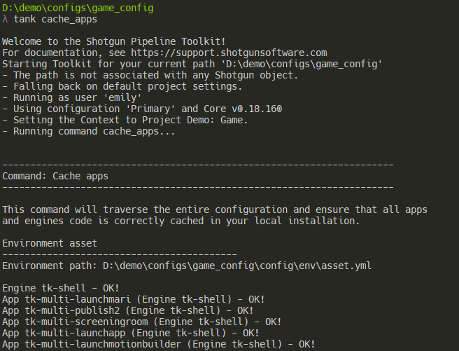


## Blender engine should be available in Shotgun Desktop

If we now go back and forth from our project in shotgun desktop ( < arrow top left if you are already within a project ), we should be able to see Blender as an application to launch.

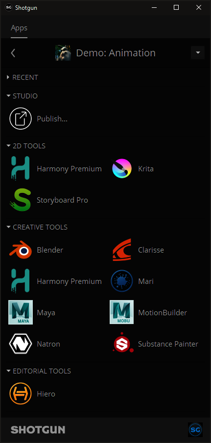

## Blender engine options:

Given past tk-engine development experiences, I decided to throw a couple of extra environment variables that can become handy when it comes to integrating this engine into a studio's pipeline.

`BLENDER_BIN_DIR`: defines where the blender executable directory is. This is used in case you decide to install Blender in a different location than the default on. Note that the toolkit official way to achieve the same is by using [tk-multi-launchapp](https://github.com/shotgunsoftware/tk-multi-launchapp), but for less complicated cases, this environment variable should be sufficient.

`SGTK_BLENDER_CMD_EXTRA_ARGS`: defines extra arguments that will be passed to blender executable when is run. For example, you might want to enable debugging within blender with the argument --debug-all. For more information about what arguments Blender takes from the command line, take a look at:

[Blender Command Line arguments](https://docs.blender.org/manual/en/latest/advanced/command_line/arguments.html)

## Toolkit Apps Included

## [tk-multi-workfiles2](https://support.shotgunsoftware.com/hc/en-us/articles/219033088)
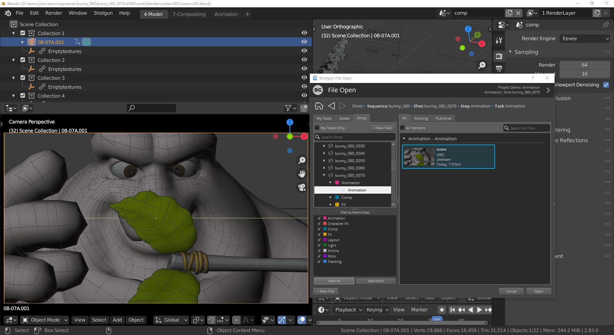

This application forms the basis for file management in the Shotgun Pipeline Toolkit. It lets you jump around quickly between your various Shotgun entities and gets you started working quickly. No path needs to be specified as the application manages that behind the scenes. The application helps you manage your working files inside a Work Area and makes it easy to share your work with others.

Basic [hooks](hooks/tk-multi-workfiles2) have been implemented for this tk-app to work. open, save, save_as, reset, and current_path are the scene operations implemented.

Check the configurations included for more details:
[additions to the configs](config/env)

## [tk-multi-snapshot](https://support.shotgunsoftware.com/hc/en-us/articles/219033068)


A Shotgun Snapshot is a quick incremental backup that lets you version and manage increments of your work without sharing it with anyone else. Take a Snapshot, add a description and a thumbnail, and you create a point in time to which you can always go back to at a later point and restore. This is useful if you are making big changes and want to make sure you have a backup of previous versions of your scene.

[Hook](hooks/tk-multi-snapshot/scene_operation_tk-blender.py) is provided to be able to use this tk-app, similar to workfiles2.

## [tk-multi-loader2](https://support.shotgunsoftware.com/hc/en-us/articles/219033078)
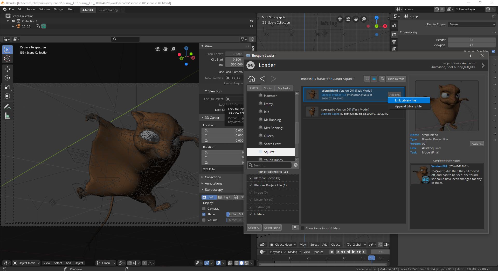

The Shotgun Loader lets you quickly overview and browse the files that you have published to Shotgun. A searchable tree view navigation system makes it easy to quickly get to the task, shot or asset that you are looking for and once there the loader shows a thumbnail based overview of all the publishes for that item. Through configurable hooks you can then easily reference or import a publish into your current scene.

[Hook](hooks/tk-multi-loader2/tk-blender_actions.py) These are the supported actions:

`append`:  [Append Library file](https://docs.blender.org/manual/en/latest/files/linked_libraries/introduction.html#append-and-link).This action will append the collections of the blender file  (.blend) that the publish file represents into the current scene.
Append makes a full copy of the data into your blend-file, without keeping any reference to the original one. You can make further edits to your local copy of the data, but changes in the external source file will not be reflected in the referencing file.

`link`: [Link Library file](https://docs.blender.org/manual/en/latest/files/linked_libraries/introduction.html#append-and-link). This action will link the collections of the blender file (.blend) that the publish file represents into the current scene.
Link creates a reference to the data in the source file such that changes made there will be reflected in the referencing file the next time it is reloaded. But linked data is not editable.

`import`: This will import the published file into the active collection. Any
Any format that is listed under [Import Scene Operators](https://docs.blender.org/api/current/bpy.ops.import_scene.html?highlight=x3d) should be supported. (`fbx, gltf, obj, x3d, ply, stl, svg, bvh`)
There is a chance that other formats might be supported by just enabling the related Import-Export Add-on.

In addition, these are also supported:
[Alembic files](https://docs.blender.org/api/current/bpy.ops.wm.html?highlight=alembic#bpy.ops.wm.alembic_import)
[Collada files](https://docs.blender.org/api/current/bpy.ops.wm.html?highlight=collada#bpy.ops.wm.collada_import)

USD: At the time of writing, USD import is not supported within Blender in an official manner, therefore it is not supported by this hook.

For more information about supported formats in Blender, check: [Import-Export Add-ons](https://docs.blender.org/manual/en/latest/addons/import_export/index.html)

`asCompositorNodeMovieClip`: As Compositor Movie Clip. This will create a new compositor node and load the movie from the PublishedFile into it.

`asCompositorNodeImage`: As Compositor Image Node. This will create a new compositor node and load the image from the PublishedFile into it. (No support for Image Sequences)

`asSequencerMovie`: As Sequencer Movie (channel 1). This will create a new sound clip in the sequencer in channel 1.

`asSequencerImage`: As Sequencer Image (channel 3). This will create a new sound clip in the sequencer in channel 3. (No support for Image Sequences)

`asSequencerSound`: As Sequencer Sound (channel 2). This will create a new sound clip in the sequencer in channel 2.

## [tk-multi-publish2](https://support.shotgunsoftware.com/hc/en-us/articles/115000097513)
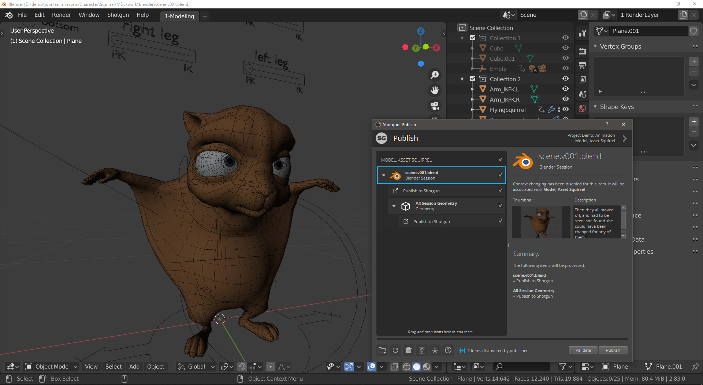

The Publish app allows artists to publish their work so that it can be used by artists downstream. It supports traditional publishing workflows within the artist’s content creation software as well as stand-alone publishing of any file on disk. When working in content creation software and using the basic Shotgun integration, the app will automatically discover and display items for the artist to publish. For more sophisticated production needs, studios can write custom publish plugins to drive artist workflows.

The basic publishing of the current session is provided as [hooks](hooks/tk-multi-publish2/basic) for this app.

The engine also provides the ability to publish alembic caches from the current scene. This is configured for the *asset step* environment.

## [tk-multi-breakdown](https://support.shotgunsoftware.com/hc/en-us/articles/219032988)
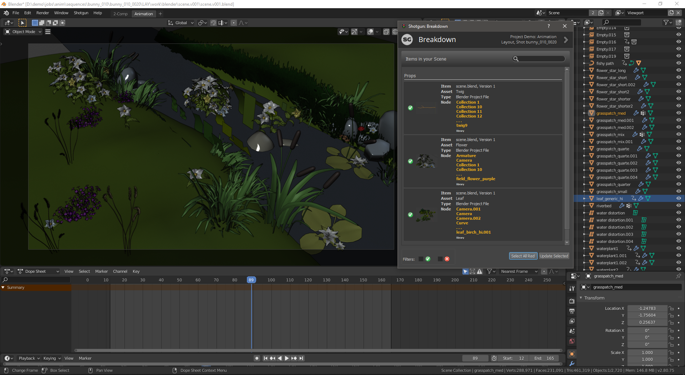

The Scene Breakdown App shows you a list of items you have loaded in your scene and tells you which ones are out of date.

[Hook](hooks/tk-multi-breakdown/tk-blender_scene_operations.py) is provided to display the following elements that are part of the current blender scene:

Libraries (linked .blend files), Cache Files, Images, Movie Clips, Texts, and Sounds.

Note that in most cases the update functionality works out of the box, except for: Texts.

## [tk-multi-setframerange](https://support.shotgunsoftware.com/hc/en-us/articles/219033038)


This is a simple yet useful app that syncs your current file with the latest frame range in Shotgun for the associated shot. If a change to the cut has come in from editorial, quickly and safely update the scene you are working on using this app. Towards the end, it will display a UI with information about what got changed.

[Hook](hooks/tk-multi-setframerange/frame_operations_tk-blender.py) is provided to set the frame range within Blender for a *shot_step* environment.

Please adjust this logic accordingly to however you want to handle frame ranges in your pipeline.

## Development notes:

The way this engine works is via a [Blender Operator](resources/extensions) that triggers the instancing of the Blender toolkit engine. Once the engine is up and running, the [menus](python/tk_blender/menu_generation.py) are created as normal using PySide2 widgets, very similar to other engines. After trying several qt styles to match the blender style I decided to not go for it, because it was causing other problems within the tk-apps. There is a rough attempt to match the size of the font from Blender menus.

Note that the way the menu is created in the main toolbar is a bit of a hack in my opinion. Initially I copy and pasted code from actual blender libraries and re-registered the whole main toolbar, which seemed to work. Unfortunately this solution was not super reliable because that piece of code used in Blender could change (in fact it changed from minor version to minor version). So I resorted to a bit more extreme way to modify the code using AST [Abstract Syntax Trees](https://docs.python.org/3.7/library/ast.html) , which allowed me to modify the code programatically.

Hopefully this solution works for newer versions of Blender, otherwise [this code will need to be revisited](https://github.com/diegogarciahuerta/tk-blender/blob/3e4c0bb9a1b70e3a6fc5d1401a434dc3a9cc5c5b/resources/scripts/startup/Shotgun_menu.py#L124)

### Blender Development notes

The biggest challenge writing this engine was a personal one, as it was the first time I had to get deep into Blender/Blender API. Getting used to new terminology, finding anything in the User Interface and figuring out what question to ask when I was having a problem was as expected a big part what kept me busy.

Blender is really powerful, and I feel I've just scratched the surface when it comes to the the integration with Shotgun. I resorted to release the engine as soon as the simplest version of all the hooks were ready, but there is so much potential to implement more publishers, loaders, etc...

It took me a while to get accustomed to Blender API, the concept of operators for everything was something new to me. Said this, their documentation is excellent and everything needed seems to be accessible through the API. For someone new to Blender like me, it is a matter to know what you are looking for in most cases, but once you get used to the terminology it is not difficult to find a solution. One thing that is tricky to keep up with is the rapid evolution of Blender and it's API. While this is a good thing, I found in many cases solutions that no longer applied to the current version I was using.

Once thing that is missinig in my opinion is a clear way to give feedback to artists that something is gone wrong. I spent quite a fair amout of time trying to research what is the best approach for this and seems like the recommended way is to log the error to the console, which I think is way too technical for artists. I see that there is the Blender Info Log window, but seems to not be used in the way I expected. I'm hoping this is due to my limited knowledge of the software and a more user friendly approach is available, if so, please let me know!

### Python3 Shotgun toolkit

Thanks to the Shotgun development team, we have Python3 support which is a hard requirement for Blender. I actually started writing this engine way before Python3 was on the cards, using a client/server architecture to communicate between two different versions of Python. Ultimately I felt like it was not the right approach and resorted to delay the work until a proper Python3 integration could be done.

### PySide2 Shotgun Toolkit support

Since Blender has it's own unique User Interface system, I needed to include PySide2 for the tk-apps to work. Initially I tried to make the menus native to Blender, but I got in trouble with operators and the dynamic nature of Shotgun menus (based on the current context). After several failed attempts, I decided that menus would also be made in PySide2, mostly because I could reuse almost all the code from other engines I've written and all the tk-apps would require it anyway. I welcome someone with the right knowledge of Blender to show a way to create dynamic menus with sub-menus on the fly, which is what is required for the integration to work.

I thank all the people that came first when it comes to making PySide2 and Blender event loops happy. My implementation of PySide2 inside Blender is heavily based in multiple already existing solutions, for example:

[blender-scripts - vincentgires](https://github.com/vincentgires/blender-scripts/blob/master/scripts/addons/qtutils/core.py)

[bqt - techartorg](https://github.com/techartorg/bqt)

[blender_pyside2_example - vfxpipeline](https://github.com/vfxpipeline/blender_pyside2_example)

[Blender Qt test - jasperges](https://gitlab.com/snippets/1881226)

***

For completion, I've kept the original README from shotgun, that include very valuable links:

## Documentation
This repository is a part of the Shotgun Pipeline Toolkit.

- For more information about this app and for release notes, *see the wiki section*.
- For general information and documentation, click here: https://support.shotgunsoftware.com/entries/95441257
- For information about Shotgun in general, click here: http://www.shotgunsoftware.com/toolkit

## Using this app in your Setup
All the apps that are part of our standard app suite are pushed to our App Store.
This is where you typically go if you want to install an app into a project you are
working on. For an overview of all the Apps and Engines in the Toolkit App Store,
click here: https://support.shotgunsoftware.com/entries/95441247.

## Have a Question?
Don't hesitate to contact us! You can find us on support@shotgunsoftware.com
